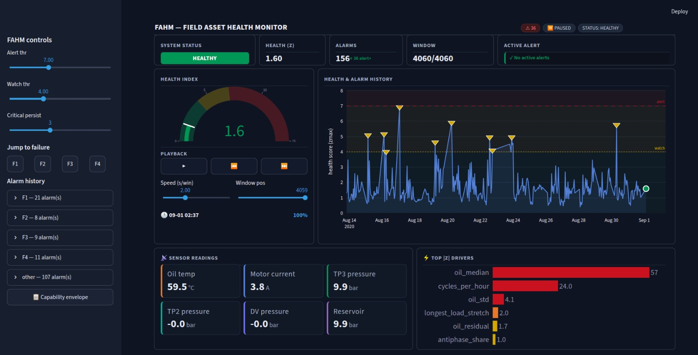

# FAHM — Field Asset Health Monitor

**Predictive maintenance on industrial sensor data: forecasting air-compressor
failures hours ahead from raw sensor data — with a live monitoring dashboard,
built to demonstrate rigor over inflated metrics.**

An honest, leakage-free anomaly-detection pipeline over the MetroPT-3 metro-train
air production unit (1,516,948 readings, 10s cadence, Feb–Sep 2020, 7 analog +
8 digital signals, four documented air-leak failures). Built end-to-end:
ingestion → EDA → feature engineering → modeling → a config-driven pipeline
runner → a real-time Streamlit dashboard. The emphasis throughout is **honest
evaluation** — per-failure detectability with real lead times, not a headline
accuracy number.


---

## The headline result

A simple, interpretable detector — **zmax**, the maximum standardized deviation
of any feature from healthy operation — warns of failures **hours ahead** from
raw sensor data. These are the **honest, leakage-free numbers** (see the rigor
story below for why they are lower than an earlier draft):

| Failure | ROC-AUC | Lead time | Verdict |
|---|---|---|---|
| F4 (gradual leak) | 0.79 (precision .48 / recall .40) | 14 h | strongest — the flagship case |
| F1 (idle-then-step leak) | 0.77 | 32.5 h | detectable, long warning |
| F3 (erratic cycling) | 0.65 | 9.6 h | marginal — rescued by cycle-dynamics features |
| F2 (short leak) | 0.65 | none | weak, no usable early warning |
| slow degradation | 0.35 | — | below chance — not caught by anomaly detection |

These are **credible predictive-maintenance numbers** — real early warning with a
real precision/recall/false-alarm tradeoff — not the leakage-driven ~100%
accuracy that a window-labeled, randomly-split setup produces.

---

## The rigor story — a leak I found in my own pipeline

Mid-project I found and fixed a **scaler-leakage bug in my own pipeline**:
features were z-scored against *all* healthy windows before the train/val split,
leaking validation statistics into the very scores meant to judge them — and a
bookkeeping column (`n_samples`) was dominating the score unscaled.

Fixing it **dropped the headline numbers by ~0.1 AUC** (F1 0.86 → 0.77,
degraded span 0.58 → 0.35). **Those lower numbers are the real ones** — and they
are what this README reports. This is the exact error criticized in a public
reference report on the same dataset; catching it in my own work is the rigor
the project claims. The full trail is in
[`decision_log.md`](decision_log.md).

---

## Why this is the hard version of the problem

Predicting a failure **before** it manifests is fundamentally different from
detecting one while it happens:

- **Trained on healthy data only** (anomaly detection), because four failures
  cannot supervise a classifier. Failures are *evaluation* targets, never
  training data.
- **Time-ordered splits**, never random — adjacent windows are near-duplicates,
  so shuffling would leak the answer.
- **Labels the lead-up, not the failure window** — the model learns to warn, not
  to describe a machine that is already broken.
- **Evaluated per failure**, because the four failures have distinct,
  multidirectional signatures (some announce with rising duty and heat, one with
  idle, one with erratic cycling).

The modest AUCs are the honest cost of solving the real problem.

---

## Core method

**zmax** — the maximum standardized deviation of any feature from healthy
operation. Chosen **not** for top accuracy (after fixing the data leak it is
*competitive with, not dominant over* IsolationForest, Mahalanobis, seven
supervised classifiers, and forecast-residual) but for being **training-free**,
**fully interpretable** — the driving feature names the suspected fault — and
giving the **longest lead times**.

### Key findings

- **Failure taxonomy — the two detectors are complementary.** Anomaly detection
  catches *unique* failures (F4: zmax 0.79 ≫ supervised 0.48); supervised
  leave-one-failure-out transfer catches *shared-pattern* failures (F3:
  supervised 0.80 > zmax 0.65). A mature system runs both.
- **F3 was the project's hardest case.** Invisible to every level, rate, and even
  spectral (Lomb-Scargle) feature, it looked genuinely undetectable. It was
  rescued by **cycle-dynamics features** (its short-cycling signature) and
  confirmed by the **leave-one-failure-out** result that F3's pattern — unlike
  F4's — is learnable from the other failures.
- **Verified-predictive features** (computed on the lead-up only, excluding
  during-failure windows to avoid describing the failure rather than predicting
  it): **oil dispersion / level** + **`tp3_decay_slope`** — the air leak measured
  *directly* (idle reservoir-pressure decay) and via its *thermal symptom* (the
  compressor overworks to compensate → heat). Cross-confirmed by zmax and XGBoost
  independently.
- **Honest labeling.** A 12-day undocumented degraded span and a ~20h
  frozen-instrument fault were carved out by investigation so that "healthy"
  windows are genuinely healthy.

---

## Pipeline

Raw CSV → **preprocess** → **features** → **score** → **evaluate**, one command.
Each stage reads and writes a parquet artifact, so stages are resumable. The
runner reproduces the notebook results exactly — the `src/fahm` package is the
single source of truth; notebooks explore, the runner orchestrates.

| Stage | In → Out | What it does |
|---|---|---|
| preprocess | raw CSV → `sensor_readings.parquet` | typed load, six integrity checks, failure windows |
| features | processed → `features.parquet` | gap-aware 1h grid, 6 feature families, scaling |
| score | features → `scores.parquet` | zmax score, alert flag, **driving feature** per window |
| evaluate | scores → `evaluation.csv` | per-failure ROC/PR-AUC, lead time, false-alarm rate |

### Method, stage by stage

**1 — Preprocessing.** Typed load (224 → 104 MB), six integrity checks that
*raise* on bad data, a gap inventory (331 gaps, 18% missing time), failure
windows sourced and verified against the dataset documentation.

**2 — EDA.** Distribution and correlation analysis with a state-mixture lens;
effect sizes rather than p-values (1.5M autocorrelated samples make significance
meaningless); corrected the documented motor-current modes against the data.

**3 — Anomaly context.** Per-failure portraits; a six-category labeling scheme
(healthy / prefail / infail / postrepair / **degraded** / **invalid**) where the
last two are *findings* — the 12-day undocumented degraded span and the 20-hour
frozen-instrument fault — carved out by investigation so the healthy baseline is
trustworthy. Base-rate controls throughout to reject spurious "near-failure"
patterns.

**4 — Feature engineering.** A gap-aware 1-hour window grid (4,060 windows), six
validated feature families (duty/state-occupancy, pressure dynamics, thermal,
variability, cycle-frequency, instrument-health). Highlights: a per-idle-stretch
pressure-decay slope (the direct leak meter), an oil residual against a healthy
oil-vs-workload baseline (separating "hot because busy" from "hot because
failing"), and multi-scale cycle features. Informative missingness handled
explicitly (indicator + fill); features scaled against healthy operation so
anomalies read as large deviations.

**5 — Modeling.** Three paradigms compared under one honest protocol: anomaly
detection (zmax wins on lead time and interpretability), supervised
leave-one-failure-out (reveals the *failure taxonomy* above — F3 is learnable
from other failures, F4 is too unique), and forecast-residual (confirms the
failures are level, not trajectory, anomalies). Full scorecard: ROC-AUC, PR-AUC,
precision/recall, lead time, false-alarm rate. Threshold presented as a tunable
operating-point menu.

---

## The dashboard

A **Streamlit real-time health monitor** — the third deliverable beyond the
notebooks and the runner:

- Dark industrial theme with a **circular health gauge** (current zmax).
- A **health-score timeline** with clickable alarm markers, alert/watch
  threshold lines, and per-failure jump-to controls.
- **Live sensor readings in physical units** (oil temperature, motor current,
  TP2/TP3/DV pressure, reservoir).
- **Top-|z| driver bars** — which features are pushing the score right now.
- A **health-vs-trust status gate** separating machine health from
  instrument-health, and a playback control that streams the window history.



---

## How to run

```bash
poetry install

# notebooks — the exploratory narrative, one per stage
poetry run jupyter lab

# headless end-to-end pipeline — raw CSV to per-failure evaluation
poetry run python run_pipeline.py --config configs/config.yaml --stage all

# the real-time dashboard
poetry run streamlit run dashboard/app.py
```

---

## Deploying this

The `score` stage emits a per-window health score, an alert flag, and the
**driving feature** — so an alert is actionable, not a black box:

> ⚠️ 2020-07-08 18:00 — health score 23.9 (threshold 7.0), driver:
> `tp3_decay_slope` → suspected air leak, ~8 h to likely failure.

Interpretable features (from the physics-first analysis) are what make the alert
a work order rather than an opaque number.

---

## Repository

```
src/fahm/            preprocessing · analysis · plotting · features · modeling
notebooks/           01–05, the exploratory narrative per stage
dashboard/           Streamlit real-time health monitor (app.py)
run_pipeline.py      config-driven end-to-end runner (headless)
configs/             config.yaml (paths, thresholds, verified label spans)
decision_log.md      the full audit trail: every decision, lesson, dead-end
```

**[`decision_log.md`](decision_log.md) is worth reading** — it documents the
reasoning behind every choice (D##), the lessons and corrections (L##), and the
open questions (OQ##), including the data-leakage patterns explicitly avoided,
the scaler-leakage bug above, and a sensor-polarity error caught by physical
reasoning.

---

## Honest limitations

- **F2 detects but doesn't warn early** — a mild thermal precursor (oil residual
  +0.64) gives moderate separability but no reliable lead time; it fires only at
  unusable alarm rates.
- **Slow degradation is below chance** (0.35) — not caught by anomaly detection;
  better read as a trend than a binary alarm.
- **Low recall** at the conservative operating threshold — the system favors
  trustworthy early warning over exhaustive flagging (one early true positive
  suffices to warn).
- **F4's precursor spans weeks** but only crosses the alarm threshold ~14 h out.

Reporting these plainly is the point: a documented capability envelope is more
useful to an engineer than a suspiciously perfect score.

---

## Future work

- **A true real-time path** — a data simulator streaming sensor rows plus
  sliding-window scoring (trailing-1h features at 10s–5min stride, coverage-based
  gap handling).
- **Ensemble evaluation** of the two complementary detectors (anomaly + supervised
  transfer) under a defined fusion rule.

---

## Stack

Python 3.11 · pandas · scikit-learn · XGBoost · scipy · Poetry ·
MetroPT-3 (UCI / Davari et al., DSAA 2021)
