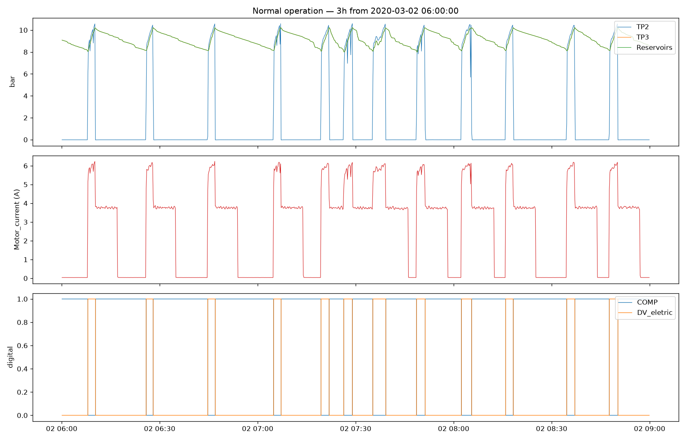
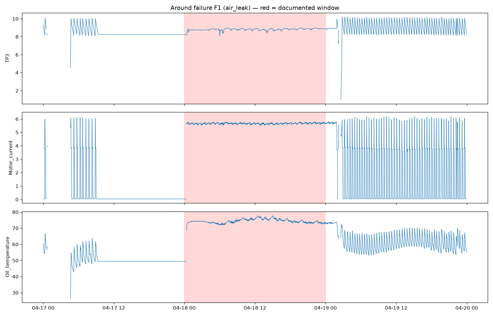

# Data Profile — MetroPT-3 (APU air compressor)

Generated from `data/processed/sensor_readings.parquet`.

## Coverage

- Rows: **1,516,948**
- Time range: **2020-02-01 00:00:00** → **2020-09-01 03:59:50**
- Modal sampling interval: **10 s**
- Non-monotonic timestamp steps: **0**
- Recording gaps > 60 s: **331** (total 54,571 min)

### Ten longest gaps

| gap_start           | gap_end             |   gap_minutes |
|:--------------------|:--------------------|--------------:|
| 2020-04-25 01:10:51 | 2020-04-27 01:12:49 |        2882   |
| 2020-06-27 10:53:07 | 2020-06-28 23:07:43 |        2174.6 |
| 2020-02-28 23:57:08 | 2020-03-01 04:00:09 |        1683   |
| 2020-08-04 07:42:28 | 2020-08-05 08:23:01 |        1480.6 |
| 2020-05-24 00:39:23 | 2020-05-25 01:14:14 |        1474.8 |
| 2020-07-07 15:24:51 | 2020-07-08 15:20:51 |        1436   |
| 2020-08-22 19:11:44 | 2020-08-23 18:51:01 |        1419.3 |
| 2020-05-10 00:31:17 | 2020-05-10 22:48:58 |        1337.7 |
| 2020-06-07 14:19:39 | 2020-06-08 11:48:04 |        1288.4 |
| 2020-04-01 13:15:40 | 2020-04-02 09:59:17 |        1243.6 |

## Sensor meaning (verify & rewrite in your own words)

|                  | physical_meaning                                                                                |
|:-----------------|:------------------------------------------------------------------------------------------------|
| TP2              | Pressure at the compressor (bar).                                                               |
| TP3              | Pressure at the pneumatic panel (bar).                                                          |
| H1               | Pressure drop at the cyclonic separator filter discharge (bar).                                 |
| DV_pressure      | Pressure drop when the air-drying towers discharge; ~0 while compressor works under load (bar). |
| Reservoirs       | Downstream reservoir pressure; should track TP3 (bar).                                          |
| Oil_temperature  | Compressor oil temperature (deg C).                                                             |
| Motor_current    | Current of one motor phase; ~0 A off, ~4 A offloaded, ~7 A under load.                          |
| COMP             | Air-intake valve signal; active when there is no air intake (compressor off or offloaded).      |
| DV_eletric       | Compressor outlet valve signal; active when compressor works under load.                        |
| Towers           | Which drying tower is active (0 = tower one, 1 = tower two).                                    |
| MPG              | Starts compressor under load when pressure < 8.2 bar.                                           |
| LPS              | Low-pressure switch; activates when pressure < 7 bar.                                           |
| Pressure_switch  | Detects discharge in the air-drying towers.                                                     |
| Oil_level        | Active (1) when oil level is BELOW expected.                                                    |
| Caudal_impulsion | Airflow signal at the compressor output.                                                        |

## Analog sensor statistics

|                 |       count |   mean |   std |    min |    25% |    50% |    75% |    max |
|:----------------|------------:|-------:|------:|-------:|-------:|-------:|-------:|-------:|
| TP2             | 1.51695e+06 |  1.368 | 3.251 | -0.032 | -0.014 | -0.012 | -0.01  | 10.676 |
| TP3             | 1.51695e+06 |  8.985 | 0.639 |  0.73  |  8.492 |  8.96  |  9.492 | 10.302 |
| H1              | 1.51695e+06 |  7.568 | 3.333 | -0.036 |  8.254 |  8.784 |  9.374 | 10.288 |
| DV_pressure     | 1.51695e+06 |  0.056 | 0.382 | -0.032 | -0.022 | -0.02  | -0.018 |  9.844 |
| Reservoirs      | 1.51695e+06 |  8.985 | 0.638 |  0.712 |  8.494 |  8.96  |  9.492 | 10.3   |
| Oil_temperature | 1.51695e+06 | 62.644 | 6.516 | 15.4   | 57.775 | 62.7   | 67.25  | 89.05  |
| Motor_current   | 1.51695e+06 |  2.05  | 2.302 |  0.02  |  0.04  |  0.045 |  3.807 |  9.295 |

## Digital signal duty (fraction of time active)

|                  |   fraction_active |
|:-----------------|------------------:|
| COMP             |            0.837  |
| DV_eletric       |            0.1606 |
| Towers           |            0.9198 |
| MPG              |            0.8327 |
| LPS              |            0.0034 |
| Pressure_switch  |            0.9914 |
| Oil_level        |            0.9042 |
| Caudal_impulsion |            0.9371 |

## Documented failure windows (evaluation ground truth)

| failure_id   | asset_id   | fault_type   | start               | end                 |
|:-------------|:-----------|:-------------|:--------------------|:--------------------|
| F1           | APU_01     | air_leak     | 2020-04-18 00:00:00 | 2020-04-18 23:59:00 |
| F2           | APU_01     | air_leak     | 2020-05-29 23:30:00 | 2020-05-30 06:00:00 |
| F3           | APU_01     | oil_leak     | 2020-06-05 10:00:00 | 2020-06-07 14:30:00 |
| F4           | APU_01     | air_leak     | 2020-07-15 14:30:00 | 2020-07-15 19:00:00 |

> Timestamps must be verified against the MetroPT paper before final evaluation numbers are reported.

## Figures

## Open questions for decision_log.md

- Is the chosen resample rate (10s / 1min) fine enough for leak dynamics?
- How should recording gaps be handled in rolling features (reset windows vs interpolate)?
- Which healthy period defines 'normal' for training the anomaly model?